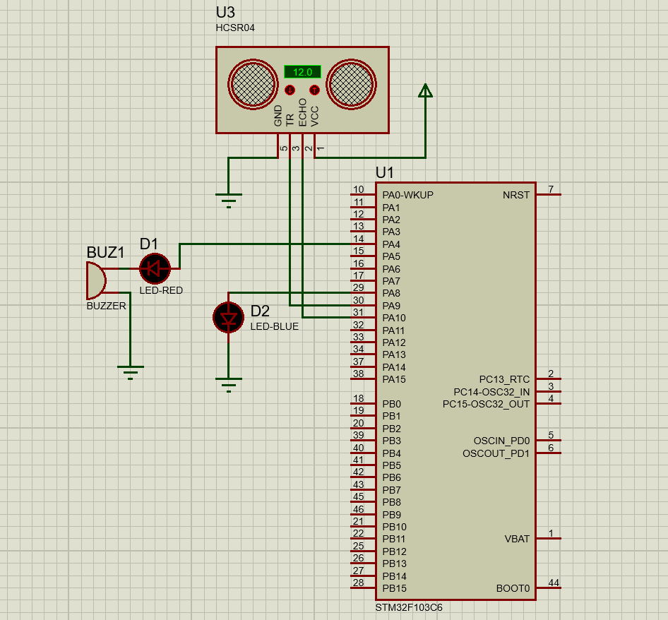

# Proximity Sensor STM32

A simple proximity sensor system that alerts drivers before a potential collision. The system uses an ultrasonic sensor to measure the distance to an object, and activates an LED and a buzzer. The buzzer alternates with a frequency proportional to the distance to the object—closer objects cause faster buzzing, providing an intuitive warning to the driver.

## Features

- **Proximity Detection**: Monitors the distance between the vehicle and nearby objects.
- **LED Alert**: LED lights up when an object is within a set range.
- **Buzzer Warning**: Audible buzzer that increases frequency as the distance decreases.
- **Custom STM32 Drivers**: The project uses custom-made drivers for STM32 to control the peripherals, all included in the repo, and at https://github.com/AhmedSaid3617/STM32-Drivers .
- **Real-time Monitoring**: Continuously tracks distance and sends it over UART module.

## Components

- **Ultrasonic Sensor**: Measures distance to nearby objects.
- **STM32F103C6 Microcontroller**: Processes the data and controls the LED and buzzer using custom drivers.
- **LED**: Turns on when an object is detected within a certain range.
- **Buzzer**: Emits sound that increases in frequency as the object gets closer.
- **Resistors, Wires, and Power Supply**: For connections and power management.

## Circuit Diagram
<p align="center">
  
</p>

## How It Works

1. The proximity sensor continuously measures the distance directly in front of it.
2. When an object is detected within a preset range (50 cm), the LED turns on.
3. The buzzer starts sounding, and its frequency increases as the distance decreases.
4. The system is designed to provide drivers with a clear and intuitive warning before a potential crash.

## Custom STM32 Drivers

This project uses custom drivers written specifically for the STM32F103C6 microcontroller to manage the proximity sensor, LED, and buzzer. These drivers allow for precise control over the peripherals, ensure efficient communication with the hardware components, and makes compiling the project easier.

- **GPIO Control**: For managing the LED and buzzer.
- **Timers**: Used to handle the sensor data and buzzer frequency adjustment.
- **UART**: Used to send distance in real-time for testing purposes as well as to be graphed or recorded.
- **Interrupts**: Used to precisely measure the time of the ECHO pulse in the ultrasonic sensor.


## Recommended compilation and installation tools.
1. **Installation**: Clone the github repo.
2. **ARM GCC toolchain**: To compile the project.
3. **GNU make**: To use the included Makefile
4. **OpenOCD**: To flash the code.

## Usage

1. **Setup**: Connect the ultrasonic sensor, LED, and buzzer to the STM32 microcontroller as per the circuit diagram. Connect UART3 module to your PC if required.
2. **Code**: Compile and flash the provided code using the makefile.
```
make
```
3. **Run**: Power the system and place it in a vehicle or test environment. The LED and buzzer will respond when objects come within the set distance.

## Demo


## License

This project is licensed under the MIT License. See the [LICENSE](LICENSE) file for details.
